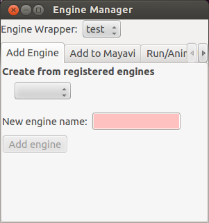
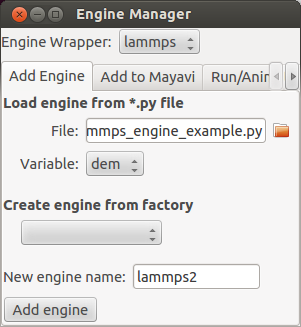

Interacting with Simphony Engine
================================

Non-GUI approach from Python Shell
----------------------------------

The :class:`~simphony_mayavi.plugins.engine_manager_standalone.EngineManagerStandalone`
is available for the user to select and visualise datasets from a Simphony Modeling
Engine via the Python shell.  It also allows the user to run the engine (locally) and
animate the visualisation after each run.

.. rubric:: Example (EngineManagerStandalone)

.. literalinclude:: ../../examples/engine_manager_standalone_example.py

.. figure:: _images/engine_manager_standalone_animate.png
	    
One can visualise multiple datasets in different scenes and animate all
of them as the engine runs.

.. literalinclude:: ../../examples/engine_manager_standalone_scenes_example.py

	    

GUI approach from Python Shell
------------------------------

:class:`~simphony_mayavi.plugins.engine_manager_standalone_ui.EngineManagerStandaloneUI`
provides a user-friendly and interactive approach to manage multiple engines, visualise
datasets from a particular engine, locally run an engine and animate the results.

.. rubric:: Example (Interactive: EngineManagerStandaloneUI)
	    
.. literalinclude:: ../../examples/engine_manager_standalone_ui.py

   Panel for adding more engine wrappers.

.. figure:: _images/engine_manager_standalone_ui_add_source.png

   Use `EngineManagerStandaloneUI` to add datasets to Mayavi.
   
.. figure:: _images/engine_manager_standalone_ui_run_and_animate.png

   Use `EngineManagerStandaloneUI` to run the engine and animate the results.

   Multiple engines can be added to or removed from (
   :func:`~simphony_mayavi.plugins.engine_manager.add_engine` and
   :func:`~simphony_mayavi.plugins.engine_manager.remove_engine`) the
   manager.  User can also add an engine by loading a python
   script file.  Only local variables are loaded.
   
.. literalinclude:: ../../examples/engine_manager_standalone_ui_add_engine.py

Interact with Simphony Engine within Mayavi2
--------------------------------------------

A Mayavi2 plugin similar to the
:class:`~simphony_mayavi.plugins.engine_manager_standalone_ui.EngineManagerStandaloneUI`
is also provided. In order to use it, one needs to first activate the plugin in
``Preferences``, following the instructions in :ref:`mayavi-plugin-setup-label`.
After that, **restart** Mayavi2.  Then the EngineManager panel can be added by selecting
``View`` --> ``Other...`` --> ``Simphony``.

   Add the Simphony Engine Manager panel

The Engine Manager is binded to the Python shell within Mayavi2 as
``simphony_panel``.

.. figure:: _images/engine_manager_mayavi2.png

Again, simphony modeling engines can be added or
removed from the panel using :func:`~simphony_mayavi.plugins.engine_manager.add_engine`
and :func:`~simphony_mayavi.plugins.engine_manager.remove_engine`.
	    
.. rubric:: Inside the Mayavi2 Python shell

.. code-block:: python

   from simphony_mayavi.sources.tests import testing_utils
   engine_wrapper = testing_utils.DummyEngine()
   simphony_panel.add_engine("Test", engine_wrapper)

