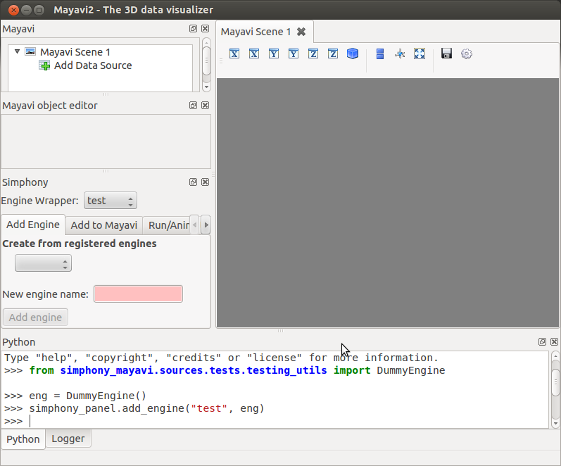

Interacting with Simphony Engine
================================

Batch scripting
---------------

Mayavi mlab library provides an easy way to visualise data in a script
in ways similar to the matplotlib's pylab module.
As illustrated with examples in :ref:`cuds_source_examples`,
the user can easily adapt SimPhoNy CUDS
datasets, files, or engines into a native Mayavi `Source` object,
and then make use of the `mlab` library to set up the visualisation.
More details on how to use the `mlab` can be found on its documentation_.

.. _documentation: http://docs.enthought.com/mayavi/mayavi/mlab.html

Here is an example for visualising a dataset from a SimPhoNy engine,
updating the visualisation and saving the image while the engine
is being run.

.. literalinclude:: ../../examples/enginesource_example.py

Making a video is just a step away!

Interactive scripting
---------------------

Non-GUI approach
................

The :class:`~simphony_mayavi.plugins.engine_manager_standalone.EngineManagerStandalone`
is available for the user to select and visualise datasets from a Simphony Modeling
Engine via the Python shell.  It also allows the user to run the engine (locally) and
animate the visualisation after each run.

.. rubric:: Example (EngineManagerStandalone)

.. literalinclude:: ../../examples/engine_manager_standalone_example.py

	    
One can visualise multiple datasets in different scenes and animate all
of them as the engine runs.

.. literalinclude:: ../../examples/engine_manager_standalone_scenes_example.py

.. figure:: _images/engine_manager_standalone_scenes_animate.png

.. _enginemanagerstandaloneui:

GUI approach
............

:class:`EngineManagerStandaloneUI <simphony_mayavi.plugins.engine_manager_standalone_ui.EngineManagerStandaloneUI>`
provides a user-friendly and interactive approach to manage multiple engines, visualise
datasets from a particular engine, locally run an engine and animate the results.

Multiple engines can be added to or removed from the manager using
:func:`add_engine <simphony_mayavi.plugins.engine_manager.add_engine>` and
:func:`remove_engine <simphony_mayavi.plugins.engine_manager.remove_engine>`.

.. rubric:: Example (Interactive: EngineManagerStandaloneUI)
	    
.. literalinclude:: ../../examples/engine_manager_standalone_ui.py

.. figure:: _images/engine_manager_standalone_ui.png

   Panel for adding more engine wrappers.

   Use `EngineManagerStandaloneUI` to add datasets to Mayavi.
   

   Use `EngineManagerStandaloneUI` to run the engine and animate the results.

Simphony GUI within Mayavi2
---------------------------

A GUI essentially identical to the 
:class:`EngineManagerStandaloneUI <simphony_mayavi.plugins.engine_manager_standalone_ui.EngineManagerStandaloneUI>`
is provided for the Mayavi2 application.
In order to use it, one needs to first activate the plugin in
``Preferences``, following the instructions in :ref:`mayavi-plugin-setup-label`.
After that, **restart** Mayavi2.  Then the EngineManager panel can be added by selecting
``View`` --> ``Other...`` --> ``Simphony``.

.. figure:: _images/engine_manager_mayavi2_setup.png

   Add the Simphony panel to Mayavi2
   

   The panel is identical to the `EngineManagerStandaloneUI`

	    
The Simphony panel is binded to the embedded Python shell within Mayavi2 as
``simphony_panel``.  Therefore the user can use the same methods as
described in :ref:`enginemanagerstandaloneui`, such as
:func:`add_engine <simphony_mayavi.plugins.engine_manager.add_engine>`
and :func:`remove_engine <simphony_mayavi.plugins.engine_manager.remove_engine>`.

Alternatively, the user can setup and load a SimPhoNy engine to Mayavi2
by running a python script from a shell or via Mayavi2 (File->Run Python Script).

The :func:`add_engine_to_mayavi2 <simphony_mayavi.plugin.add_engine_to_mayavi2>`
method in the `simphony.visualisation.mayavi_tools` namespace is provided for
this purpose as illustrated in the following example.

.. literalinclude:: ../../examples/lammps_engine_example.py

This example sets up a Simphony LAMMPS engine and starts
Mayavi2 with the engine loaded in the GUI.

