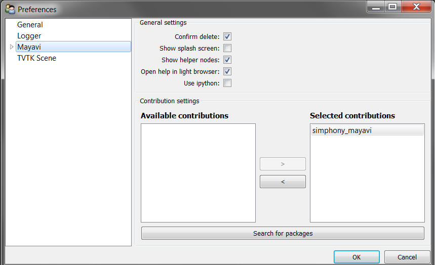
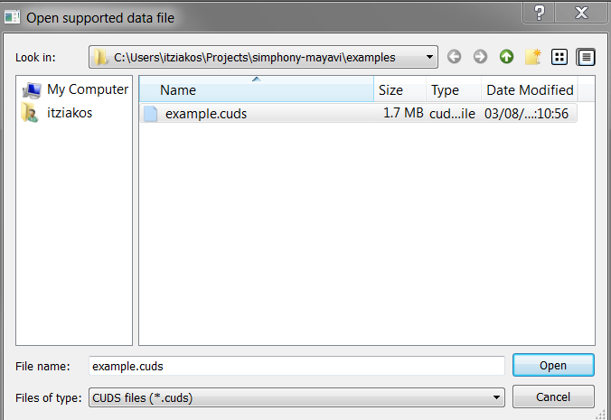
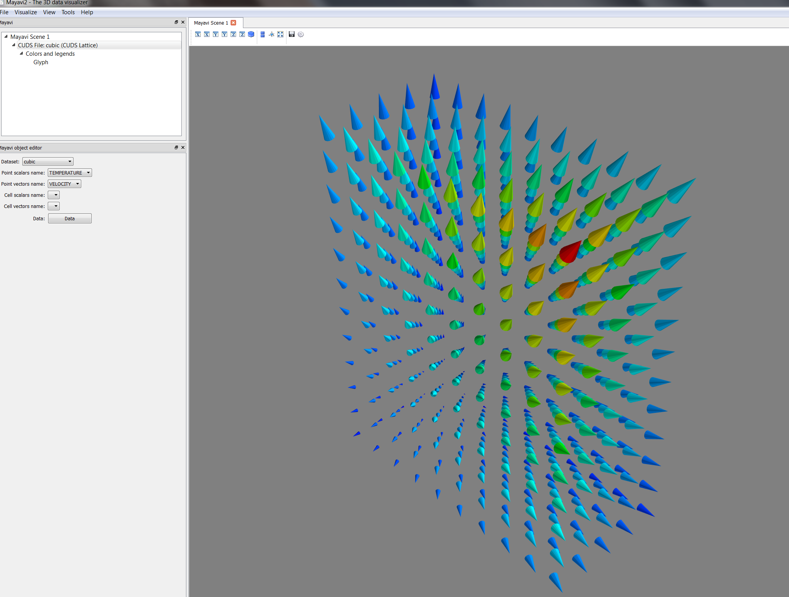
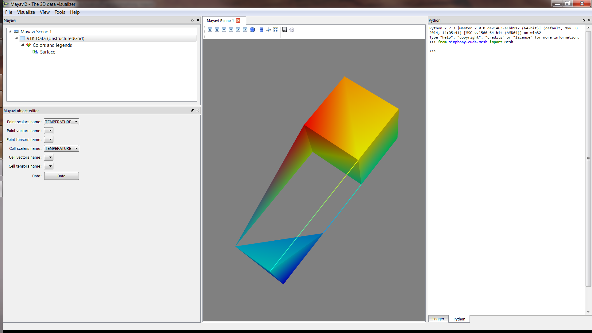
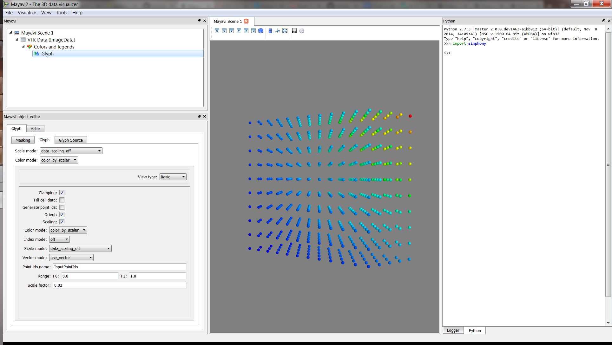
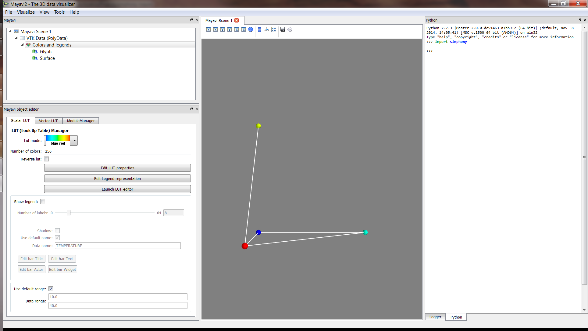
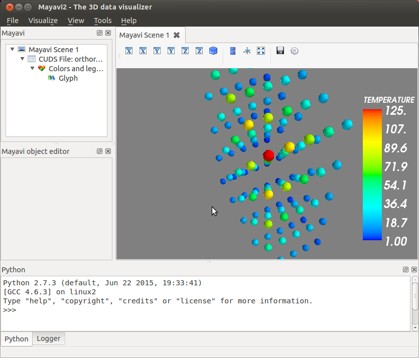
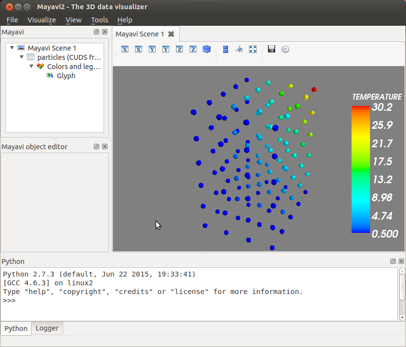

Mayavi2
=======

The Simphony-Mayavi library provides a plugin for Mayavi2 to easily
create mayavi ``Source`` instances from SimPhoNy CUDS datasets and
files.

Any CUDS datastet can be adapted as a mayavi ``Source`` using
:class:`CUDSSource <simphony_mayavi.sources.cuds_source.CUDSSource>`.
If CUDS datasets are to be loaded from a
CUDS native file, it maybe easier to use
:class:`CUDSFileSource <simphony_mayavi.sources.cuds_file_source.CUDSFileSource>`
which does the loading for you.  Similarly, if the CUDS datasets
are from a SimPhoNy engine wrapper,
:class:`EngineSource <simphony_mayavi.sources.engine_source.EngineSource>`
may be used.  All of these ``Source`` objects provide an
:func:`update <simphony_mayavi.sources.cuds_source.CUDSSource.update>`
function that allows the user to refresh visualisation once the
CUDS dataset is modified.

With the provided tools one can use the SimPhoNy libraries to
work inside the Mayavi2 application, as it is demonstrated in the
examples.

.. _mayavi-plugin-setup-label:

Open CUDS Files in Mayavi2
--------------------------

In order for mayavi2 to understand ``*.cuds`` files one needs to make
sure that the simpony_mayavi plugin has been selected and activated in
the Mayavi2 preferences dialog.

   Cuds files are supported in the ``Open File..`` dialog. After running
   the :download:`provided example <../../examples/cuds_file_mayavi2.py>`,
   load the ``example.cuds`` file into Mayavi2.

   When loaded a CUDSFile is converted into a Mayavi Source and the
   user can add normal Mayavi modules to visualise the currently
   selected CUDS container from the available containers in the file.

   In the example we load the container named ``cubic`` and attach the
   Glyph module to draw a cone at each point to visualise ``TEMPERATURE``
   and ``VELOCITY`` in the Mayavi Scene.

View CUDS in Mayavi2
--------------------

.. rubric:: Source from a CUDS Mesh

.. literalinclude:: ../../examples/mesh_mayavi2.py

   Use the provided example to create a CUDS Mesh and visualise
   directly in Mayavi2.

.. rubric:: Source from a CUDS Lattice

.. literalinclude:: ../../examples/lattice_mayavi2.py

   Use the provided example to create a CUDS Lattice and visualise
   directly in Mayavi2.

.. rubric:: Source for a CUDS Particles

.. literalinclude:: ../../examples/particles_mayavi2.py

   Use the provided example to create a CUDS Particles and visualise
   directly in Mayavi2.

.. rubric:: Source from a CUDS native file

.. literalinclude:: ../../examples/cudsfilesource_mayavi2.py

   Use the provided example to load data from a CUDS file and visualise
   directly in Mayavi2.

.. rubric:: Source from a SimPhoNy engine wrapper

.. literalinclude:: ../../examples/enginesource_mayavi2.py

   Use the provided example to load data from a SimPhoNy engine
   and visualise directly in Mayavi2.

   In the Mayavi2 embedded python interpreter, the user can access
   the SimPhoNy engine wrapper associated with the
   :class:`EngineSource <simphony_mayavi.sources.engine_source.EngineSource>`
   via its ``engine`` attribute::

     # Retrieve the EngineSource
     source = engine.scenes[0].children[0]

     # The SimPhoNy engine wrapper originally defined
     source.engine

     # Run the engine
     source.engine.run()

     # update the visualisation
     source.update()
