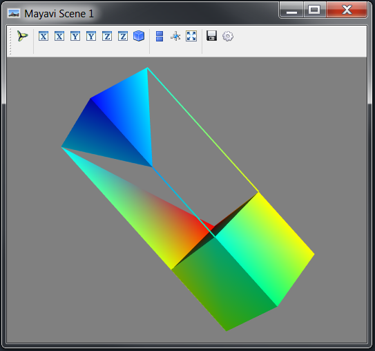
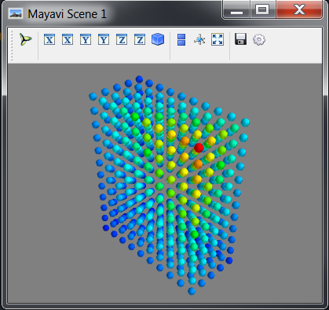
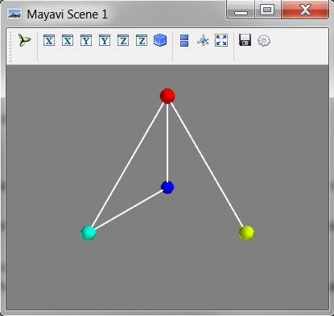
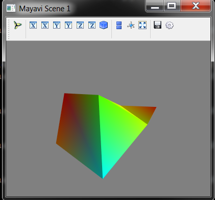
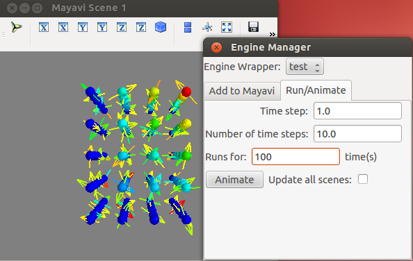
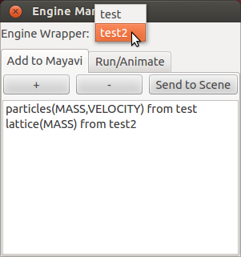

SimPhoNy
========

Mayavi tools are available in the simphony library through the
visualisation plug-in named ``mayavi_tools``.

e.g::

  from simphony.visualisation import mayavi_tools

Visualizing CUDS
----------------

The :func:`~simphony_mayavi.show.show` function is available to
visualise any top level CUDS container. The function will open a
window containing a 3D view and a mayavi toolbar. Interaction
allows the common `mayavi operations`_.

.. rubric:: Mesh example

.. literalinclude:: ../../examples/mesh_example.py

.. rubric:: Lattice example

.. literalinclude:: ../../examples/lattice_example.py

.. rubric:: Particles example

.. literalinclude:: ../../examples/particles_example.py

Create VTK backed CUDS
----------------------

Three objects (i.e class:`~. VTKMesh`, class:`~.VTKLattice`,
`~.VTKParticles`) that wrap a VTK dataset and provide the CUDS top
level container API are also available. The vtk backed objects are
expected to provide memory and some speed advantages when Mayavi aided
visualisation and processing is a major part of the working session.
The provided examples are equivalent to the ones in section
`Visualizing CUDS`_.

.. note:: Note all CUBA keys are supported for the `data` attribute of the contained
	  items. Please see documentation for more details.

.. rubric:: VTK Mesh example

.. literalinclude:: ../../examples/mesh_vtk_example.py

.. rubric:: VTK Lattice example

.. literalinclude:: ../../examples/lattice_vtk_example.py

.. rubric:: VTK Particles example

.. literalinclude:: ../../examples/particles_vtk_example.py

Adapting VTK datasets
---------------------

The :func:`~simphony_mayavi.adapt2cuds.adapt2cuds` function is
available to wrap common VTK datsets into top level CUDS
containers. The function will attempt to automatically adapt the
(t)vtk Dataset into a CUDS container. When automatic conversion
fails the user can always force the kind of the container to adapt into.
Furthermore, the user can define the mapping of the included
attribute data into corresponding CUBA keys (a common case for
vtk datasets that come from vtk reader objects).

.. rubric:: Example

.. literalinclude:: ../../examples/adapt2cuds_example.py

Loading into CUDS
-----------------

The :func:`~simphony_mayavi.load.load` function is available to
load mayavi readable files (e.g. VTK xml format) into top level
CUDS containers. Using ``load`` the user can import inside their
simulation scripts files that have been created by other
simulation application and export data into one of the Mayavi
supported formats.

.. _mayavi operations: http://docs.enthought.com/mayavi/mayavi/mlab_changing_object_looks.html?highlight=toolbar#changing-object-properties-interactively

.. _engine-manager-standalone-label:

Interacting with Simphony Engine
--------------------------------

The :class:`~simphony_mayavi.plugins.engine_manager_standalone.EngineManagerStandalone`
and :class:`~simphony_mayavi.plugins.engine_manager_standalone_ui.EngineManagerStandaloneUI`
are available for the user to select and visualise datasets from a
Simphony Modeling Engine via the Python shell (EngineManagerStandalone)
or via an interactive GUI (EngineManagerStandaloneUI).

.. rubric:: Example (Script-able: EngineManagerStandalone)

.. literalinclude:: ../../examples/engine_manager_standalone_example.py

.. figure:: _images/engine_manager_standalone_animate.png
	    
One can visualise multiple datasets in different scenes and animate all
of them as the engine runs.

.. literalinclude:: ../../examples/engine_manager_standalone_scenes_example.py

.. figure:: _images/engine_manager_standalone_scenes_animate.png

.. rubric:: Example (Interactive: EngineManagerStandaloneUI)
	    
.. literalinclude:: ../../examples/engine_manager_standalone_ui.py

.. figure:: _images/engine_manager_standalone_ui.png

   Use `EngineManagerStandaloneUI` to add datasets to Mayavi.
   

   Use `EngineManagerStandaloneUI` to run the engine and animate the results.

   Multiple engines can be added to the manager and be selected for
   visualisation and animations.
   
.. literalinclude:: ../../examples/engine_manager_standalone_ui_add_engine.py

 
   
